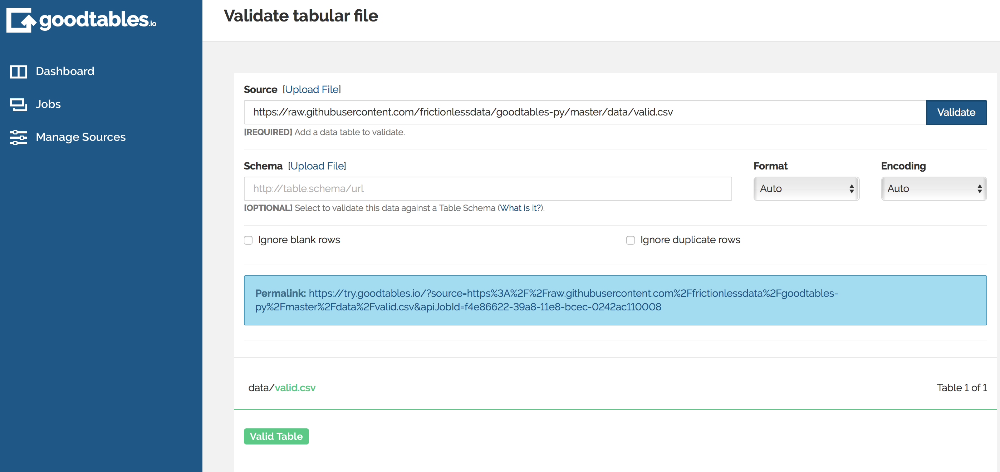
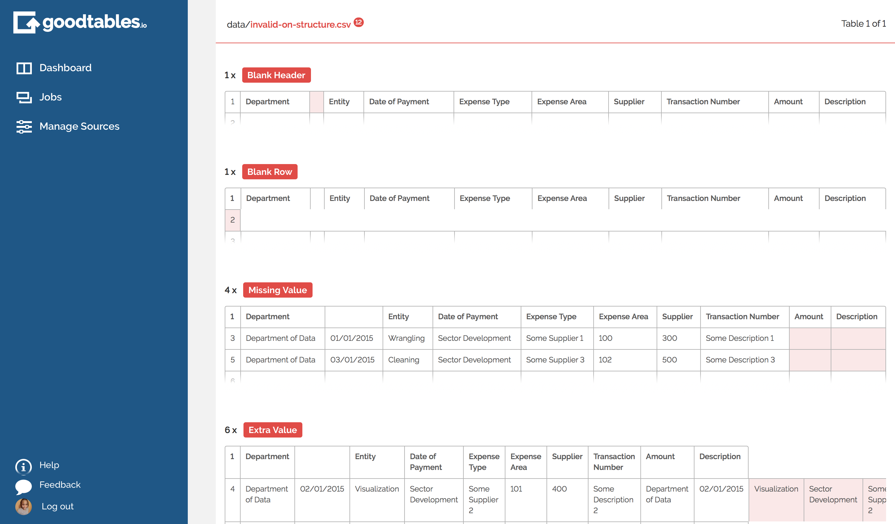

Tabular data (e.g. data stored in [CSV](/docs/csv/) and Excel worksheets) is one of the most common forms of data available on the web. This guide will walk through validating tabular data using Frictionless Data software.

This guide show how you can validate your tabular data and check both:

* Structure: are there too many rows or columns in some places?
* Schema: does the data fit its schema. Are the values in the date column actually dates? Are all the numbers greater than zero?

We will walk through two methods of performing validation:

* Web service: an online service called **goodtables**. This option requires no technical knowledge or expertise.
* Using the [Python goodtables library](https://github.com/frictionlessdata/goodtables-py). This allows you full control over the validation process but requires knowledge of Python.

## goodtables

[goodtables](http://goodtables.io/) is a free, open-source, hosted
service for validating tabular data. goodtables checks your data for
its *structure*, and, optionally, its adherence to a specified *schema*. Where the latter fails, goodtables highlights content errors so you can fix them speedily.

!! goodtables will give quick and simple feedback on where your tabular
data may not yet be quite perfect.


To get started with one-off validation of your tabular datasets, use [try.goodtables.io](http://try.goodtables.io). All you need to do is upload or provide a link to a CSV
file and hit the "Validate" button.


If your data is structurally valid, you should receive the following
result:



If not...



The report should highlight the structural issues found in your data
for correction.  For instance, a poorly structured tabular dataset may
consist of a header row with too many (or too few) columns when
compared to of data rows with an equal amount of columns.

You can also provide a schema for your tabular data defined using JSON
Table Schema.


Briefly, the format allows users to specify not only
the types of information within each column in a tabular dataset, but
also expected values.  For more information, see the
[Table Schema guide](/docs/table-schema/) or
[the full standard](/specs/table-schema/).

## Python + goodtables

goodtables is also available as a Python library.  The following short
snippets demonstrate examples of loading and validating data in a file
called `data.csv`(and in the second example, validating the same data file against `schema.json`)

### Validating Structure

```python
from goodtables import validate

report = validate('data.csv')
report['valid']
report['table-count']
report['error-count']
report['tables'][0]['valid']
report['tables'][0]['source']
report['tables'][0]['errors'][0]['code']
```


### Validating Schema

```python
from goodtables import validate

# sync source/schema fields order
report = validate('data.csv', schema='schema.json', order_fields=True)

...
```

## Continuous Data Validation

In a bid to streamline the process of data validation and ensure seamless integration is possible in different publishing workflows, we have set up a continuous data validation hosted service that builds on top of Frictionless Data libraries. goodtables.io provides support for different backends. At this time, users can use it to check any datasets hosted on GitHub and Amazon S3 buckets, automatically running validation against data files every time they are updated, and providing a user friendly report of any issues found.


Start your continuous data validation here: <https://goodtables.io>

Blog post on goodtables python library and goodtables web service: <http://okfnlabs.org/blog/2017/05/22/introducing-the-new-goodtables-library-and-goodtablesio.html>

See the `README.md` for more information.

!! Find more examples on validating tabular data in the [Frictionless Data Field Guide][field-guide]

[dp]: /docs/data-package
[dp-main]: /data-packages
[tdp]: /docs/tabular-data-package/
[ts]: /docs/table-schema/
[ts-types]: /specs/table-schema/#field-descriptors
[csv]: /docs/csv/
[json]: http://en.wikipedia.org/wiki/JSON
[field-guide]: /field-guide

[spec-dp]: /specs/data-package/
[spec-tdp]: /specs/tabular-data-package/
[spec-ts]: /specs/table-schema/
[spec-csvddf]: /specs/csv-dialect/

[publish]: /docs/publish/
[pub-tabular]: /docs/publish-tabular/
[pub-online]: /docs/publish-online/
[pub-any]: /docs/publish-any/
[pub-geo]: /docs/publish-geo/
[pub-faq]: /docs/publish-faq/

[tools]: /software/
[dp-creator]: http://create.frictionlessdata.io
[dp-viewer]: http://create.frictionlessdata.io
