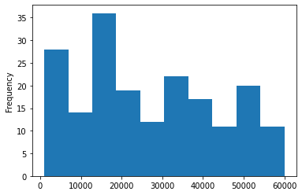

# How to use Data Packages with CKAN

[](https://colab.research.google.com/drive/18xFFAooVcca5wfW-7hW_juLkaTdN9FI0)


---

**Intermediate |	Python |	Datapackage**

---
## Learning Goals
- Learn how to read a public CKAN dataset and read it as Data Package
- Leant how to export the data package as a Pandas data frame to analyze and visualize it 
- This How-To assumes knowledge of how to create a [data package](TODO: add docs link) and how to use [CKAN](https://ckan.org/)

## Step 0: Installation


```python
!pip install datapackage
!pip install tableschema-pandas
!pip install tableschema-ckan-datastore
```

## Step 1: Create a data package from a public CKAN dataset


```python
from datapackage import Package

package = Package(storage='ckan_datastore', base_url='https://catalogue.data.gov.bc.ca/', dataset_id='bc-population-estimates')
print(len(package.resources))
```

    2


## Step 2: Export a data package's resource as a Pandas data frame


```python
dfs = package.save(storage='pandas')
df = dfs['4ab68723_adb0_4147_a943_a5bf9080b768'] # TODO: for now, the ckan driver uses a underscored resource's id for addressing
print(df)
```

             Development Region  Regional District SGC  ...     2017     2018
    0                   Cariboo                53000.0  ...    638.0    640.0
    1                   Cariboo                53000.0  ...   3883.0   3858.0
    2                   Cariboo                53000.0  ...  77936.0  78675.0
    3                   Cariboo                53000.0  ...  15968.0  16110.0
    4                   Cariboo                53000.0  ...   1054.0   1076.0
    ..                      ...                    ...  ...      ...      ...
    185  Vancouver Island/Coast                43000.0  ...   4361.0   4393.0
    186  Vancouver Island/Coast                27000.0  ...   7324.0   7462.0
    187  Vancouver Island/Coast                43000.0  ...   2429.0   2413.0
    188  Vancouver Island/Coast                21000.0  ...   3757.0   3762.0
    189  Vancouver Island/Coast                43000.0  ...   3556.0   3611.0
    
    [190 rows x 14 columns]


## Step 3: You can now use Pandas functions to work with your CKAN resource!


```python
df['Municipality SGC'].plot(kind='hist')
```


    <matplotlib.axes._subplots.AxesSubplot at 0x7f8c7c8e6a90>





## Related Reference Documentation
- https://github.com/frictionlessdata/tableschema-ckan-datastore-py
- https://github.com/frictionlessdata/tableschema-pandas-py
- https://github.com/frictionlessdata/datapackage-py